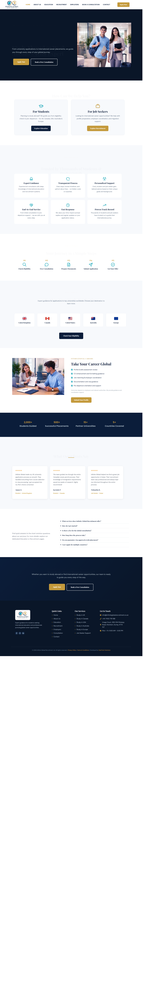

# Infinite Global Recruitment

> **UK-based Education Consultancy & International Recruitment Agency** - A full multi-page website with 7 content pages, custom header, and footer for a company that helps students study abroad and connects international talent with UK employers.

## About This Project

| Detail | Value |
|--------|-------|
| **Client** | Infinite Global Recruitment |
| **Industry** | Education Consultancy & International Recruitment |
| **Location** | Hersham, Surrey, United Kingdom |
| **Site Type** | Multi-page business website (9 templates total) |
| **Live URL** | https://elemento.deshtech.lk |
| **Build Date** | February 2026 |
| **Pages** | 7 content pages + header + footer |

## Design System

### Colors

| Token | Value | Usage |
|-------|-------|-------|
| Primary (Navy) | `#0B1D3A` | Headings, primary buttons, header text |
| Secondary (Gold) | `#C49A3C` | Overlines, CTA buttons, accents, nav hover |
| Accent (Teal) | `#2AADBD` | Education pathway, stats, icon accents |
| Dark | `#0A1628` | Hero sections, CTA banners, footer |
| Light | `#F7F9FC` | Alternating section backgrounds, form fields |
| Warm | `#FBF8F3` | Testimonial section backgrounds |
| Text Secondary | `#5A6B7F` | Body text, descriptions |
| Text on Dark | `#B0BEC5` | Body text on dark backgrounds |
| Border | `#E2E8F0` | Form field borders, card borders |

### Typography

| Element | Font | Weight |
|---------|------|--------|
| Headings | Playfair Display | 700 |
| Body | DM Sans | 400 |
| Overlines/Labels | DM Sans | 600, uppercase, 2-3px letter-spacing |
| Buttons | DM Sans | 600 |

## Pages

1. **Home** (9 sections) - Hero with dual pathways (Students + Job Seekers), Why Choose Us (6 feature cards with Iconify icons), How It Works (5-step process), Education Teaser, Recruitment Teaser, Testimonials (3 cards with star ratings), FAQ Snippet, CTA Banner
2. **About Us** (7 sections) - Company story split layout, Mission & Values (3 cards), Why Choose Us, Journey Timeline, Team section, CTA Banner
3. **Education** (8 sections) - Study abroad destinations (6 country cards), Academic Pathways (4 cards), Application process steps, Stats counters, Testimonials, CTA Banner
4. **Recruitment** (8 sections) - Recruitment services (6 cards), Process steps, Industry sectors (6 cards), Screening & Compliance checklist, Stats, Testimonials, CTA Banner
5. **Employers** (9 sections) - Why Partner With Us (6 cards), Sectors We Cover, 5-Step Recruitment Process, Screening & Compliance, Stats (4 counters), Post a Vacancy Form (8 fields), Employer FAQ (6 Q&As), CTA Banner
6. **Book a Consultation** (5 sections) - Student Eligibility Form, Job Seeker Profile Form, Why Choose Us, CTA Banner
7. **Contact** (5 sections) - Contact info + form split layout, Quick Actions (3 cards), Our Location with address, CTA Banner
8. **Header** - Logo + Nav Menu (hamburger on tablet/mobile) + CTA button, sticky with shadow
9. **Footer** - 4-column: Brand + Quick Links + Services + Contact info with social icons

## Files

| File | Size | Description |
|------|------|-------------|
| `home.json` | 718 KB | Homepage with 9 sections |
| `employers.json` | 730 KB | Employers page with vacancy form and FAQ |
| `recruitment.json` | 664 KB | Recruitment services page |
| `education.json` | 564 KB | Education & study abroad page |
| `about.json` | 427 KB | About Us page with timeline |
| `book-consultation.json` | 325 KB | Dual consultation forms |
| `contact.json` | 221 KB | Contact page with form and location |
| `footer.json` | 142 KB | Site footer (4-column, dark) |
| `header.json` | 51 KB | Site header with nav-menu widget |
| `brief.json` | 31 KB | Complete project brief with all content |
| `design-tokens.json` | 10 KB | Colors, fonts, spacing, components |
| `page-mapping.json` | 0.3 KB | WordPress page/template IDs |
| `screenshot.png` | 1,305 KB | Full-page homepage screenshot |

## Key Design Patterns

- **Overline labels**: Gold (#C49A3C), DM Sans 14px, 600 weight, uppercase, 2-3px letter-spacing
- **Card hover**: Box shadow with `0 8px 30px rgba(0,0,0,0.08)`, 16px border-radius
- **Dark hero sections**: Background #0A1628, split layout (55%/40%), image on right
- **Iconify icons**: Tabler icon set for all standalone icons (e.g., `tabler:rocket`, `tabler:school`)
- **Font Awesome**: Used only for icon-list widgets and social-icons
- **FAQ sections**: Stacked cards (900px boxed width), #F7F9FC background, 24px padding, 8px border-radius
- **Forms**: Light field background (#F7F9FC), subtle border (#E2E8F0), 8px radius, honeypot spam protection
- **Social icons**: Circle shape, dark bg (#1A3050), muted glyph (#B0BEC5), gold hover (#C49A3C)
- **Nav menu**: Hamburger on tablet+, uppercase dropdown text, stretch full-width dropdown

## How to Use This Starter Kit

### As a Reference
Study the JSON structure, section patterns, and design tokens. Use the `design-tokens.json` to understand the complete color and typography system.

### As a Starting Point
1. Copy the page JSONs you want to use
2. Update colors, fonts, and content from your new project's `brief.json`
3. Replace placeholder images with real ones
4. Update form `email_to` addresses
5. Push to your WordPress site via `sync.ps1`

## WordPress IDs (Reference Only)

| Template | WordPress ID |
|----------|-------------|
| Home | 74 |
| About Us | 108 |
| Education | 113 |
| Recruitment | 117 |
| Book a Consultation | 121 |
| Contact | 140 |
| Employers | 219 |
| Header (template) | 152 |
| Footer (template) | 223 |
